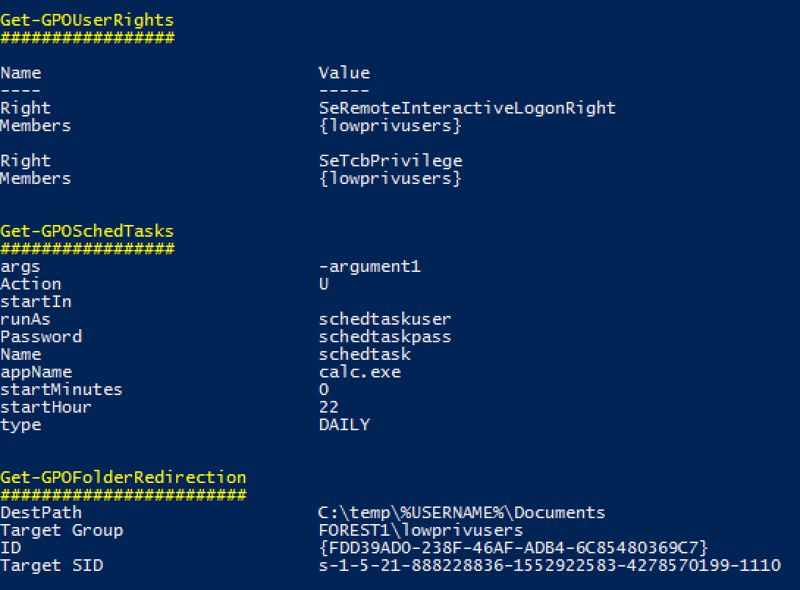

# Grouper

DONT USE GROUPER ANY MORE. USE GROUPER2! https://github.com/l0ss/Grouper2

A PowerShell script for helping to find vulnerable settings in AD Group Policy.


###### *Photo by Jon Hanson* - <https://www.flickr.com/people/61952179@N00?rb=1> - <https://creativecommons.org/licenses/by-sa/2.0/>

## Summary
Grouper is a PowerShell module designed for pentesters and redteamers (although probably also useful for sysadmins) which sifts through the (usually very noisy) XML output from the Get-GPOReport cmdlet (part of Microsoft's Group Policy module) and identifies all the settings defined in Group Policy Objects (GPOs) that might prove useful to someone trying to do something fun/evil.

Examples of the kinds of stuff it finds in GPOs:
* GPOs which grant modify permissions on the GPO itself to non-default users.
* Startup and shutdown scripts
    * arguments and script themselves often include creds.
    * scripts are often stored with permissions that allow you to modify them.
* MSI installers being automatically deployed
    * again, often stored somewhere that will grant you modify permissions.
* Good old fashioned Group Policy Preferences passwords.
* Autologon registry entries containing credentials.
* Other creds being stored in the registry for fun stuff like VNC.
* Scheduled tasks with stored credentials.
    * Also often run stuff from poorly secured file shares.
* User Rights
    * Handy to spot where admins accidentally granted 'Domain Users' RDP access or those fun rights that let you run mimikatz even without full admin privs.
* Tweaks to local file permissions
    * Good for finding those machines where the admins just stamped "Full Control" for "Everyone" on "C:\Program Files".
* File Shares
* INI Files
* Environment Variables
* ... and much more! (well, not very much, but some)

Yes it's pretty rough, but it saves me an enormous amount of time reading through those awful 150MB HTML GPO reports, and if it works for me it might work for you.

Note: While some function names might include the word audit, Groper is explicitly NOT meant to be an exhaustive audit for best practice configurations etc. If you want that, you should be using Microsoft SCT and LGPO.exe or something.

## Usage

Generate a GPO Report on a Windows machine with the Group Policy cmdlets installed.
These are installed on Domain Controllers by default, can be installed on Windows clients using RSAT, or can be enabled through the "Add Feature" wizard on Windows servers.

```
Get-GPOReport -All -ReportType xml -Path C:\temp\gporeport.xml
```

Import the Grouper module.

```
Import-Module .\grouper.psm1
```

Run Grouper.

```
Invoke-AuditGPOReport -Path C:\temp\gporeport.xml
```

## Parameters
There's also a couple of parameters you can mess with that alter which policy settings Grouper will show you:
```
-showDisabled
```
By default, Grouper will only show you GPOs that are currently enabled and linked to an OU in AD. This toggles that behaviour.
```
-Online
```
By default Grouper only works with the actual XML output from Get-GPOReport, and does no network comms at all, making it quite "opsec safe", though I do hate that term. 

If you invoke it with -Online, Grouper will turn on checks that require talking to (at least) the AD domain from which the report was generated, but will also likely involve talking to e.g. file servers. This will allow Grouper to do handy things like report the ACLs on files targeted by GPOs, and check if e.g. the current user can write to the file in question.
```
-Level
```
Grouper has 3 levels of filtering you can apply to its output.

1. Show me all the settings you can.
2. (Default) Show me only settings that seem 'interesting' but may or may not be vulnerable.
3. Show me only settings that are definitely a super bad idea and will probably have creds in them or are going to otherwise grant me admin on a host.

Usage is straightforward. -Level 3, -Level 2, etc.

___
## Frequently Asked Questions

### I'm on a gig and can't find a domain-joined machine that I have access to with the Group Policy cmdlets installed and I don't want to install them because that's noisy and messy!

Get-GPOReport works just fine on non-domain-joined machines via runas /netonly. You'll need some low-priv creds but that's to be expected.

Do like this:

```
runas /netonly /user:domain\user powershell.exe
```

on a non-domain-joined machine that can communicate with a domain controller.

Then in the resulting PowerShell session do like this:

```
Get-GpoReport -Domain example.com -All -ReportType xml -Path C:\temp\gporeport.xml
```

Easy.

### I don't trust you so I don't want to run your skeevy looking script on a domain-joined machine, but I want to try Grouper.

All Grouper needs to work is PowerShell 2.0 and the xml file output from Get-GPOReport. You can run it on a VM with no network card if you're worried and it'll still work fine.

That said, it's pretty basic code so it shouldn't be hard to see that it's not doing anything remotely sketchy.

### I think it's dumb that you are relying on the MS Group Policy cmdlets/RSAT for Grouper. You should just write it to directly query the domain or parse the policy files straight out of SYSVOL.

Short answer: Yep.

Long answer: Yep, doing one of those things would be better, but there are a couple of things that prevented me from doing them YET.

Ideally I'd like to parse the policy files straight off SYSVOL, but they are stored in a bunch of different file formats, some are proprietary, they're a real pain to read, and I have neither the time nor the inclination to write a bunch of parsers for them from scratch when Microsoft already provide cmdlets that do the job very nicely.

In the not-too-distant future I'd like to bake Microsoft's Get-GPOReport into Grouper, so you wouldn't need RSAT at all, but I need to figure out if that's going to be some kind of copyright violation. I also need to figure out how to actually do that thing I just said.
___

## Questions that I am anticipating

### Grouper is showing me all these settings that aren't vulnerable. WTF BRO FALSE POSITIVE MUCH?

Grouper is not a vulnerability scanner. Grouper merely filters the enormous amount of fluff and noise in Group Policy reports to show you only the policy settings that COULD be configured in exploitable ways.

To the extent possible I am working through each of the categories of checks to add in some extra filtering to remove obviously non-vulnerable configurations and reduce the noise levels even further, but Group Policy is extremely flexible and it's pretty difficult to anticipate every possible mistake an admin might make.

### Grouper didn't show me a thing that I know is totally vulnerable in Group Policy. WTF BRO FALSE NEGATIVE MUCH?

Cool, you just found a way to make Grouper better! Scroll down and you'll see where I've provided a little guide to adding new checks to Grouper.

### I don't have a lab environment and I don't have a GPO report file handy! I'm also very impatient!
I got your back, kid. There's a test_report.xml in the repo that you can try it out with. It's got a bunch of bad settings in it so you can see what that looks like.

You'll need to run it with the -showDisabled flag because it's so full of really awful configurations I didn't even want to enable the GPO in a lab environment.

### I'm even more impatient than that last guy and I demand pretty pictures immediately!
OK.



### But wait, how do I figure out which users/computers these policies apply to? Your thing is useless!
Short Answer: PowerView will do a decent job of this.

Longer Answer: I'll be trying to add this functionality at some point but in the meantime, shut up and use PowerView.

### I hate one of the checks Grouper does and I never want to see it again.

Cool, easily fixed.

Pop open grouper.ps1, find the "$polchecks" array and just comment out the line where that check gets added to the array.

Done.

### I want to make Grouper better but I can't make sense of your awful spaghetti-code. Help me help you.

Sure thing, sounds good.

1. Get some GPOReport xml output that includes the type of policy/setting you want Grouper to be able to find. This may require knocking up a suitable policy in a lab environment.

2. Find the \<GPO\> xml object that matches your target policy.

3. Find the subsection of the xml that matches the info you want to pull out of the policy. Policy settings are divided into either User or Computer policy, so this will usually be in either:
    ```
    GPO.Computer.ExtensionData.Extension
    or
    GPO.User.ExtensionData.Extension
    ```

4. Now's the annoying part - the reason this code is such a mess is that each policy setting section is structured differently and they use wildly differing naming conventions, so you're going to need to figure out how your target policy is structured. Good luck?

6. Here's a skeleton of a check function you can use to get started. Make sure it either doesn't return at all or returns $null if nothing interesting is found.

    ```
    Function Get-GPOThing {
        [cmdletbinding()]
        Param (
            [Parameter(Mandatory=$true)][ValidateNotNullOrEmpty()]  [System.Xml.XmlElement]$polXML,
            [Parameter(Mandatory=$true)][ValidateSet(1,2,3)][int]$level
        )

        ######
        # Description: Checks for Things.
        # Vulnerable: Description of what it shows if Level -eq 3
        # Interesting: Description of what it shows if Level -eq 2
        # Boring: All Things.
        ######

    	$settingsThings = ($polXml.Thing.ExtensionData.Extension.Thing |  Sort-Object GPOSettingOrder)

        if ($settingsThings) {
    	    foreach ($setting in $settingsThings) {
                if ($level -eq 1) {
                    $output = @{}
                    $output.Add("Name", $setting.Name)
                    if ($setting.SettingBoolean) {
                        $output.Add("SettingBoolean", $setting.SettingBoolean)
                    }
                    if ($setting.SettingNumber) {
                        $output.Add("SettingNumber", $setting.SettingNumber)
                    }
                    $output.Add("Type", $setting.Type.InnerText)
                    Write-Output $output
                    ""
                }
            }
        }
    }

    ```

7. Ctrl-f your way down to "$polchecks" and add it to the array of checks with the others.

8. Test it out.

9. If it works, submit a pull request!

10. If you get stuck, hit me up. I'll try to help if I can scrounge a few minutes together.

___

## Credits, complaints, comments, death threats, errata

Thank you very much to:
* @harmj0y for his GPP password decryption helper function.
* @sysop_host and @prashant3535 for their assistance and encouragement. I believe there is probably still a line or two stolen from @sysop_host still in this thing but I'm really not sure where and I would hate to blame him for my shitty code.

Speaking of shitty code, yes I know this is a bit of a mess. I've tried to make it as modular as possible so others should be able to add additional checks without too much hassle, but it still needs a lot of love. If you see a mistake I've made that desperately needs fixing, please let me know.
